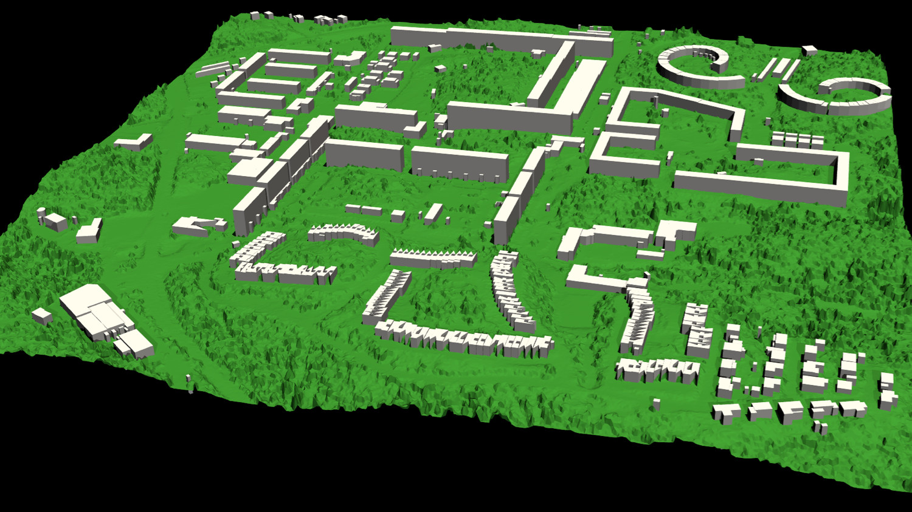

# Digital Twin Cities Platform - Core

The Digital Twin Cities Platform is an open-source platform for the
exploration of digital twins for cities. The platform is developed and
maintained by the Digital Twin Cities Centre (DTCC) hosted by Chalmers
University of Technology. The aim is to develop an open multimodal
data, modeling, simulation and visualization platform for interactive
planning, design, exploration, experimentation and optimization of
cities.

This repositotory (Core) provides software for data processing,
modeling and simulation.



## Getting started

These instructions will get you a copy of the project up and running on your local machine for development and testing purposes. See deployment for notes on how to deploy the project on a live system.

### Pipeline overview

WIP: Describe pipeline overview.

### Building the Docker container

The most convenient way to work with the Digital Twin Cities Platform
is via the custom [Docker](https://www.docker.com/) image, which
contains all the dependencies needed for developing, building and
running the software.

The first step is to download and install [Docker](https://www.docker.com/). After Docker has been installed, continue with the following steps.

To build the Docker image for VCCore, enter the `docker` directory and issue the following command:

    ./dtcc-build-image

if your host operating system is Linux, or

    ./dtcc-build-image.bat

if your host operating system is Windows.

This creates a Docker image named `vcimage`.

Then issue the following command to create and start a persistent container (virtual machine) in which to run VCCore:

    ./dtcc-create-container
    ./dtcc-start-container

if your host operating system is Linux, or

    ./dtcc-create-container.bat
    ./dtcc-start-container.bat

if your host operating system is Windows.

This creates a Docker container named `vccontainer` that is used for developing, building and running VCCore.

Note that the VCCore source tree is shared into the Docker container.

### Downloading data

To download data for VCCore, enter the `data` directory and issue the following command:

    ./vc-download-demo-data

Note that this step should be done outside of the Docker container (to ensure that you have the proper access to the data repository).

### Building and installation

To build VCCore, use a standard out-of-source CMake build by issuing the following commands from the top level directory:

    mkdir build
    cd build
    cmake ..
    make
    make install

This will build and install all programs and scripts into the top level `bin` directory.

### Running the demo

To run a simple demo, enter the `demo` directory and issue the following command:

    ./vc-demo

This will generate a height map from point cloud data, generate a city model from a property map, and finally generate meshes. Both the input and output data can be found in the `data` directory. The parameters for the demo are controlled by the file `Parameters.json` (see below).

## Deployment

WIP: Describe how to deploy on cloud server.

## Data sources

VCCore makes use of the following data sources:

* Point clouds (Lantmäteriet:Laserdata vektor EPSG:3006)
* Property maps (Fastighetskartan bebyggelse vektor EPSG:3006)

Chalmers has a license for downloading data from `http://zeus.slu.se`.

Point cloud data comes in the form of a number square grids big enough to cover the requested domain. Each point cloud is compressed as a RAR file. Uncompress it to get the LAS point cloud file, for example:

    unrar e 09B008_64050_3225_25.rar

This will create the file 09B008_64050_3225_25.las. The lower left corner will in this example be at EPSG:3006 coordinates (6405000, 322500).

Property map data comes in the form of SHP files (with corresponding SHX, DBF and PRJ files). The files of interest are the ones named `by_get.*`.

## Data formats

WIP: Describe internal JSON format.

WIP: Describe CityJSON format.

## Coordinate system

VCCore users meters as a unit of length, relative to the SWEREF99 TM (EPSG:3006) coordinate system.

## Parameters

VCCore uses the following global parameters, controlled via a JSON file `Parameters.json`.

All data files are assumed to be located in a directory determined by the
parameter `DataDirectory`. Any generated data files will be stored in the
same location.

    DataDirectory = directory for input/output

When parsing data from original data files (LAS point clouds and SHP files), a nonzero origin may be specified to offset the coordinate system relative to the origin. This has the advantage that very large values for the coordinates may be avoided (which is good for numerical stability).

    X0 = x-coordinate of new origin
    Y0 = y-coordinate of new origin

In other words, the offset (X0, Y0) is subtracted from the original coordinates during processing. In the simplest case, the offset should be set to the coordinates of the lower left (south-east) corner of the domain covered by the data.

Height maps, city models and meshes are generated for a rectangular domain with coordinates relative to the new origin specified by `X0` and `Y0`.

    XMin = x-coordinate for lower left corner
    YMin = y-coordinate for lower left corner
    XMax = x-coordinate for upper right corner
    YMax = y-coordinate for upper right corner

In the simplest case, the lower left corner should be set to (XMin, YMin) = (0, 0) and the upper right corner should be set to (XMax, YMax) = (Width, Height).

Alternatively, the domain may be determined by the bounding box of the point cloud(s) by. If `AutoDomain` is `true`, then XMin, YMin, XMax, YMax are automatically determined (and their parameter values ignored).

    AutoDomain = true/false

When generating the height map from LAS point cloud data, the `HeighMapResolution` parameter determines the resolution of the grid on to which the height map is sampled.

    HeightMapResolution = resolution of height map grid

When generating the city model from SHP file data, the `MinimalBuildingDistance` parameter determines a minimal distance between buildings. Buildings that are closer than the specified distance are automatically merged to avoid overlapping buildings or buildings that are very close (which may otherwise upset the mesh generation).

    MinimalBuildingDistance = minimal distance between buildings

When generating the volume mesh, the `DomainHeight` parameter determines the height of the domain relative to the average ground level.

    DomainHeight = height of computational domain (volume mesh)

When generating both volume and visualization meshes, the `MeshResolution` parameter determines the maximum size (diameter) of the mesh cells.

    MeshResolution = resolution of computational mesh (mesh size)

Both volume and visualization meshes may be generated with our without displacing the ground level outside of buildings. If the `FlatGround` parameter is set to `true`, then the ground is kept flat.

    FlatGround = true / false

## Code organization

VCCore is organized as a collection of independent but interoperable components. Each component may be implemented using different libraries, and languages (C++, Python, ...) but follows a common naming scheme and provides a standardized command-line interface.

Common C++ code that is used across components is header only and is placed in the common directory `include`. The common code should have no (or minimal) external dependencies.

## Coding style

VCCore uses Microsoft C# coding style (for both C++ and Python code):

```
ClassName
MemberFunction
PublicMemberVariable
privateMemberVariable
argumentName
variableName
```

Code formatting is enforced using [ClangFormat](https://clang.llvm.org/docs/ClangFormat.html) as defined in the top-level `.clang-format` file. The style is based on the default LLVM style with minimal modifications.

Algorithms should be implemented as static functions in separate classes (for example in the class `MeshGenerator` rather than in the class `Mesh`). This means that pure data classes (like `Mesh`) can be kept clean with only class data and functions for data access and initialization.

## Versioning

VCCore uses [CalVer](https://calver.org/) for versioning.

## Authors (in order of appearance)

* [Anders Logg](http://anders.logg.org)
* [Vasilis Naserentin](https://www.chalmers.se/en/Staff/Pages/vasnas.aspx)

## License

VCCore is licensed under TBD.

## Acknowledgments
