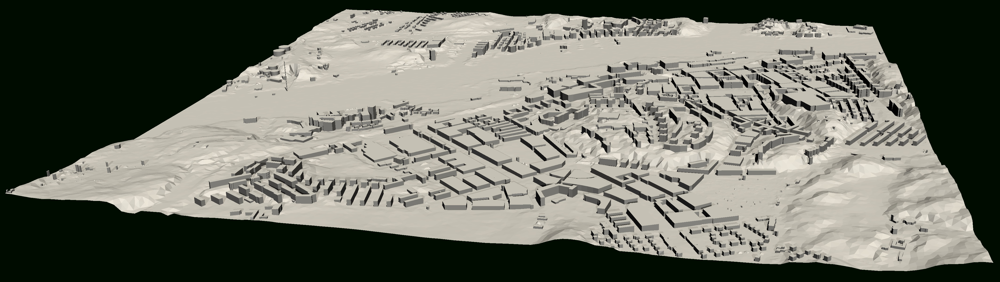
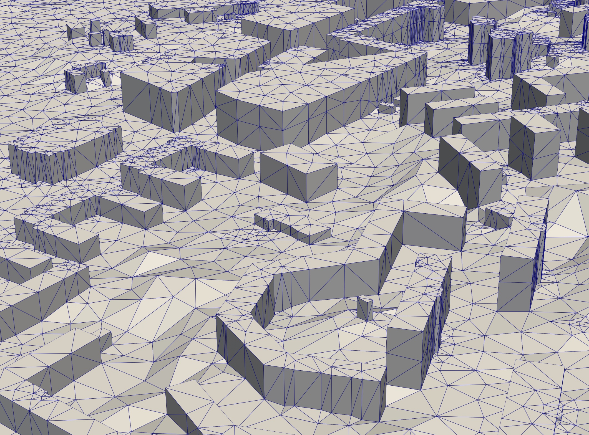

# Summary

DTCC Builder is a mesh generator for automatic, efficient, and robust
mesh generation for large-scale city modeling and simulation.  Using
standard and widely available raw data sources in the form of point
clouds and cadastral data, DTCC Builder generates high-quality 3D
surface and volume meshes, suitable for both visualization and
simulation. In particular, DTCC Builder is capable of generating
large-scale, conforming tetrahedral volume meshes of cities suitable
for finite element (FEM) simulation.

# Statement of need

The interest in creating digital twins, i.e., models that mirror
physical systems in real-time and enable analysis and prediction, has
been rapidly increasing in recent years. In particular, there has
been a surge in the interest for creating digital twins of cities
[@ketzlerDigitalTwinsCities2020]. The creation of a digital twin of a
city often involves the creation of a 3D model. Such 3D models may
either be created manually, semi-automatically, or in a fully
automatic way from available raw data, often in the form of point
clouds obtained from aerial scanning and cadastral data (property
maps).

3D mesh generation is a very challenging process, especially in the
face of bad quality and low resolution data, which is often the case
for publicly available data for cities. Furthermore, if the 3D meshes
are to be used for modeling and simulation, certain requirements are
posed on the quality of the meshes. DTCC Builder aims to solve these
challenges by automating the mesh generation process in a both robust
and efficient way. Related work on 3D mesh generation for city
modeling include [@ledouxCityJSONCompactEasytouse2019],
[@ledoux3dfierAutomaticReconstruction2021], and
[@padenAutomaticReconstruction3D2022].

DTCC Builder is part of the open-source digital twin platform
[DTCC Platform](https://platform.dtcc.chalmers.se) developed at the
[Digital Twin Cities Centre](https://dtcc.chalmers.se).

# Functionality

DTCC Builder provides two main programs: `dtcc-generate-citymodel` and
`dtcc-generate-mesh`. The two programs are run in sequence. First,
`dtcc-generate-citymodel` generates a city model from input data in
the form of one or more point clouds and cadastral data. Then,
`dtcc-generate-mesh` reads the generated city model and generates
output data in the form of both triangular surface meshes and
tetrahedral volume meshes. \autoref{fig:demo-majorna} and
\autoref{fig:demo-majorna-zoom} show a surface mesh generated for an
area in Gothenburg.

# Method and implementation

DTCC Builder uses a novel algorithm for mesh generation. The key idea
is to utilize the special geometry of city models to reduce the 3D
mesh generation problem to a 2D problem. A 2D mesh respecting the
polygonal footprints of buildings is generated and then layered to
create a 3D mesh. Building heights and ground height are incorporated
through a PDE-based smoothing process. The method and algorihtms are
described in detail in the paper [@naserentinDigitalTwinsCity2022].

DTCC Builder is implemented in C++ and makes use of several
open-source packages, notably FEniCS
[@loggAutomatedSolutionDifferential2012] for solving PDEs, Triangle
[@shewchukTriangleEngineering2D1996] for 2D mesh generation, and GEOS
[@geoscontributorsGEOSCoordinateTransformation2021] for geometric
operations.

# Documentation

The documentation for DTCC Builder is published on the
[DTCC Builder GitLab pages](https://gitlab.com/dtcc-platform/dtcc-builder)
as well as on the documentation pages for
[DTCC Platform](https://platform.dtcc.chalmers.se).

# Limitations and future work

DTCC Builder currently only provides a C++ and command-line
interface. Future versions will provide a Python interface and also an
online interface as part of
[DTCC Platform](https://platform.dtcc.chalmers.se).

DTCC Builder currently generates city models in Level of Detail (LoD)
1.2 but ongoing work seeks to extend DTCC Builder to LoD1.3 and LoD2.x.

DTCC Builder currently runs on a single thread. Future versions versions will
provide means of parallelization across shared or distributed memory.

# Acknowledgements

This work is part of the Digital Twin Cities Centre supported by
Sweden’s Innovation Agency Vinnova under Grant No.  2019-00041.

# References
